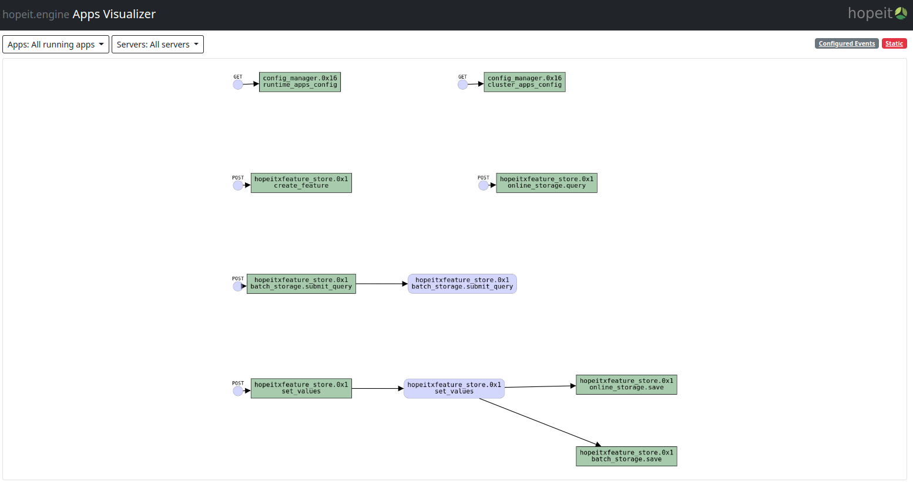

# hopeit.feature-store

Machine Learning applications Feature Store implemented using hopeit.engine

## for Machine Learning Engineers and Data Scientists:

[OCTOBER 2022: WE'VE JUST STARTED!]

The idea of this project is to implement our custom Feature Store
from scratch to save and serve feature for Machine Learning use cases
using micro services architecture in Python.

We'll combine implementation of endpoints, streams and event handlers
using [`hopeit.engine`](https://github.com/hopeit-git/hopeit.engine)

This is an opportunity to learn Python, micro-services in general
and about Feature Stores in particular.

Here's a diagram of how the endpoints and events for the initial architecture:

There'll be online sessions for the development. I will announce here and in [LinkedIn](https://www.linkedin.com/in/leosmerling/).

Please fork and subscribe to Github notifications for this repo if you are interested in participating!

Leo.
